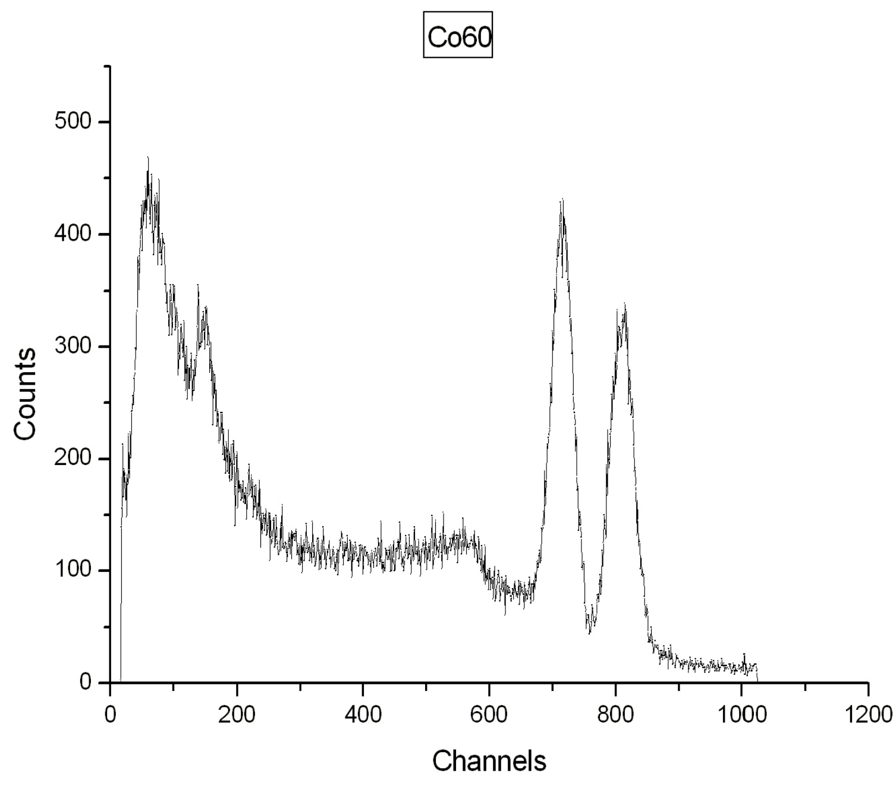
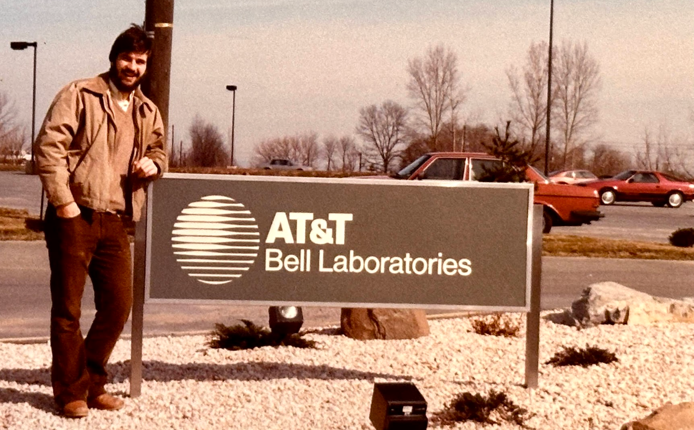
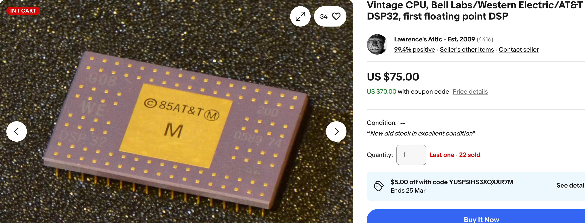

# About this Book

When I was an undergraduate college student I worked in a physics lab.  The lab had a device called a [Gamma Ray Spectrometer](https://en.wikipedia.org/wiki/Gamma-ray_spectrometer).  The spectrometer put out a data on a teletype interface that showed the energy of different frequencies of gamma rays.  My professor asked me to automate the process of analyzing soil samples for different radioactive elements like Uranium.

To do this work, we needed to do frequency analysis of this data.  I had to copy the data from the spectrometer to a 6502 microcomputer and move that data to a VAX-11 780 that had a total of 1MB of RAM (for the entire campus).  It did have a FORTRAN compiler and I found a book that had the FFT algorithm it it.  I dutifully types in the FORTRAN code and ran my first FFT, displaying the results on a beautiful [Tektronix](https://en.wikipedia.org/wiki/Tektronix_4010) graphics display terminal.  I spent many late hours in the basement of the computer center doing experiments with looking at the transforms of different data.  My girlfriend at the time had to come drag me out of the lab to go to the college dance parties.

I was hooked.

From that time forward, I started to see the world through the lens of data transformation.
Everything I looked at I could see through the lens of frequency analysis.  I looked at a piano and it was a Fourier transform.  Each key on a piano was mapped to a specific frequency of sound.  I went on to work with and design components for digital signal processing (DSP) chips at Bell Labs including the first 32-bit floating point DSP.  

{ width="280px"}{ width="450px"}

I was forever transformed by my fascination with moving data to a different representation, manipulating the transformed data there and tansforming it back to the real world.

Fast forward to 2024 and the Raspberry Pi Foundation announces that their new Pico 2 microcontroller that had a retail list price of $5.99 would include DSP instructions for accelerating FFTs.  How could I not try it out!

This book was written with the hope that we could help others along their journey to visualize data transformations.  This skill can be quickly generalized to many other domains such as machine learning and the generation of concept embeddings.  I hope the reader will find this as fascinating as I have.  I dedicate this book to all my future students that learn to see the world through transformations.

But don't miss the dance party!  We had a lot of fun!