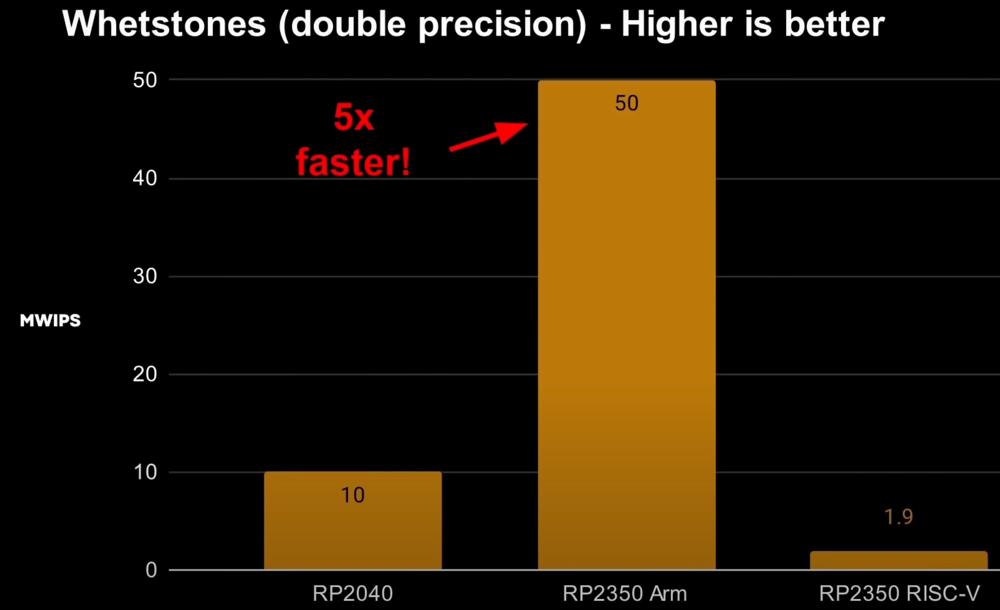
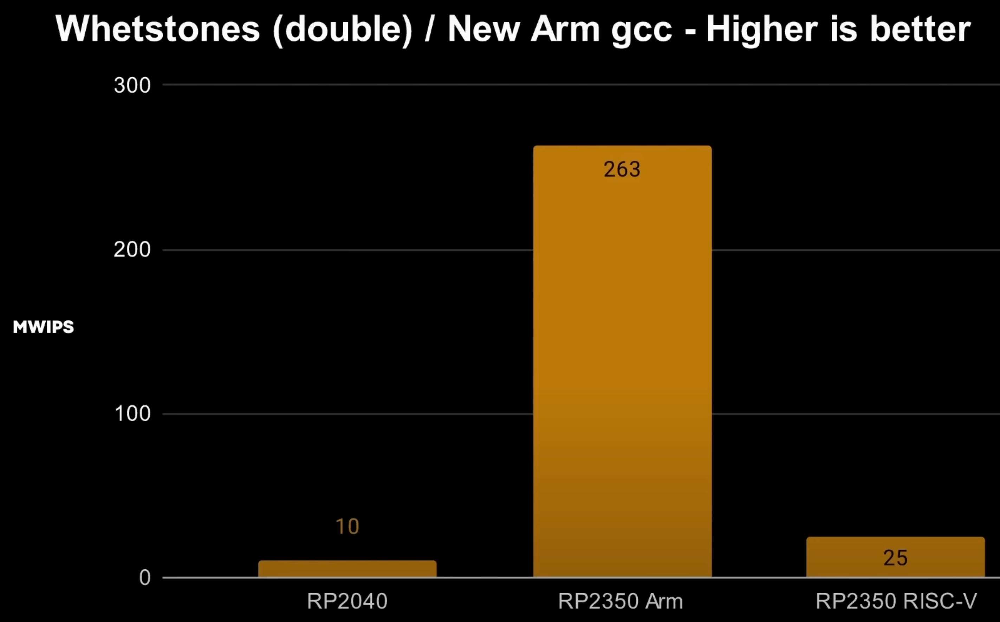

# Floating Point Speedup

Only the UNIX shell Arm compiler will give you the best performance for using the new floating point hardware on the Pico 2.

Using the Windows C compiler you only get a 5x speedup:

Speedup using the new Arm compiler on UNIX command line we get a 26x speedup!

## References

[YouTube Gary Explains](https://www.youtube.com/watch?v=_O3Aeyv2ILM)