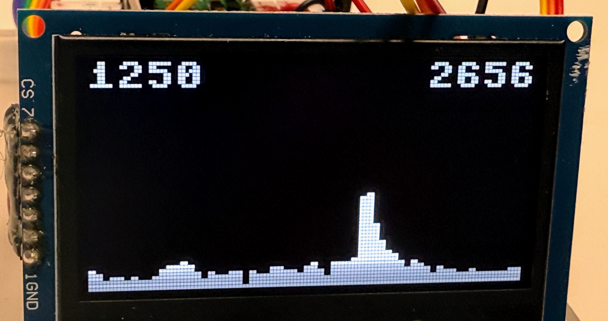
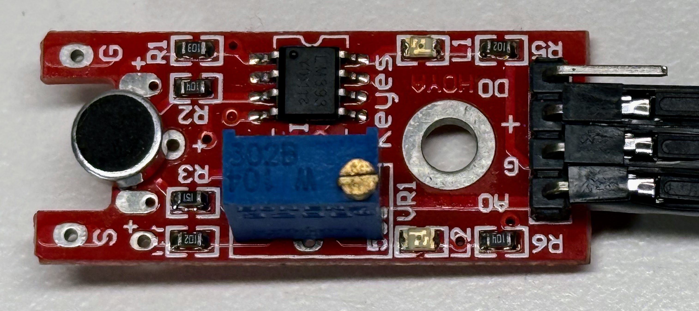

# Spectrum Analyzer

<iframe width="560" height="315" src="https://www.youtube.com/embed/mszrdmg-LGs?si=CH0wDvMqMIrb2otL" title="YouTube video player" frameborder="0" allow="accelerometer; autoplay; clipboard-write; encrypted-media; gyroscope; picture-in-picture; web-share" referrerpolicy="strict-origin-when-cross-origin" allowfullscreen></iframe>

* Upper left is peak frequency 1,250 Hz
* Right is max frequency
* Frequency resolution: 31.25 Hz per bin
* Display frequency range: 0 Hz to 2656 Hz
* FFT size: 512
* Sample rate: 16,000 Hz
* I am whistling a tone at 1,250 Hz
* Microphone: [INMP445](../../sensors/15-inmp441.md)

## ChatGPT Prompt

!!! prompt
    I would like to create an audio spectrum analyzer using a Raspberry Pi Pico 2 and a 128x64 OLED display using MicroPython. How would you suggest I go about this project. Break it down step-by-step.

I started this project using a low-cost sound sensor below, but then I upgraded to the [INMP445](../../sensors/15-inmp441.md) on the I2S bus after seeing many problems with noise on the ADC.

 

## ChatGPT GPT-4 Response

Creating an audio spectrum analyzer with a Raspberry Pi Pico and a 128x64 OLED display using MicroPython is a fascinating project that combines hardware interfacing with digital signal processing. Below is a step-by-step guide to help you get started on this project.

### Step 1: Gather the Components

1.  **Raspberry Pi Pico**: A microcontroller board based on the RP2040 microcontroller chip.
2.  **128x64 OLED Display**: This will be used for visualizing the audio spectrum. Ensure it's compatible with the Pi Pico, ideally one that communicates over I2C or SPI.
3.  **Electret Microphone Amplifier**: This captures the audio signals. A module like the MAX4466 or a similar one would be suitable.
4.  **Jump Wires**: For connecting the components.
5.  **Breadboard**: Useful for prototyping without soldering.
6.  **USB Cable**: For programming the Raspberry Pi Pico.

### Step 2: Set Up the Raspberry Pi Pico

1.  **Install MicroPython**: Download and flash MicroPython onto the Raspberry Pi Pico. The Raspberry Pi Pico documentation provides clear instructions for this process.
2.  **Prepare Your Development Environment**: Install any necessary drivers and a code editor that supports MicroPython, such as Thonny or Visual Studio Code with the appropriate extensions.

### Step 3: Connect the Hardware

1.  **Microphone to Pi Pico**: Connect the output of the electret microphone amplifier to one of the analog input pins of the Pi Pico. Also, connect the ground and Vcc pins accordingly.
2.  **OLED Display to Pi Pico**: Connect the OLED display to the Pi Pico using I2C or SPI, depending on your display module. For I2C, you'll need to connect SDA, SCL, Vcc, and GND. For SPI, the connections will include SCK, MOSI, RES, DC, CS, Vcc, and GND.

### Step 4: Write the Software

1.  **Initialize the OLED Display**: Write or adapt a MicroPython script to initialize the OLED display using the appropriate library. There are libraries available for both I2C and SPI OLED displays in MicroPython.
2.  **Capture Audio Data**: Write a script to capture audio data from the microphone using the ADC (Analog to Digital Converter) of the Pi Pico. The data capture should be done in real-time, and you may need to experiment with sampling rates.
3.  **Process Audio Data**: Implement a Fast Fourier Transform (FFT) algorithm to convert the time-domain audio signals into the frequency domain. This step is crucial for creating the spectrum analysis.
4.  **Visualize the Spectrum**: Map the frequency domain data to the OLED display. You will likely need to scale the data to fit nicely on the 128x64 display, representing different frequencies and their intensities.

### Step 5: Testing and Troubleshooting

1.  **Run Your Script**: Test the entire system by running your script. You may need to adjust the audio capture settings or the way the data is visualized on the OLED display.
2.  **Troubleshoot**: If you encounter issues, use serial print statements to debug and understand where things might be going wrong.

### Step 6: Refinement and Expansion

1.  **Refine the Display**: You can refine how the audio spectrum is displayed, perhaps by adjusting the resolution, colors (if your OLED supports it), or adding additional visual elements like peak hold.
2.  **Experiment with Features**: Consider adding features such as different modes for the spectrum analyzer, audio input from different sources, or even a GUI for interacting with the device.

### Resources

-   [MicroPython Documentation](https://docs.micropython.org/en/latest/): Essential for understanding how to program the Raspberry Pi Pico.
-   **MicroPython FFT Libraries**: Look for MicroPython libraries or examples of FFT implementations suitable for the Raspberry Pi Pico.  For example [Peter Hinch's FFT Libaray](https://github.com/peterhinch/micropython-fourier) on GitHub.  Peter has a Single precision FFT written in ARM assembler.
-   **OLED Libraries**: Find libraries specific to your OLED display model for easier programming.
- [ADC Sampling and FFT on Raspberry Pi Pico](https://www.hackster.io/AlexWulff/adc-sampling-and-fft-on-raspberry-pi-pico-f883dd) on Alex Wulff on hackster.io

This project involves a mix of hardware setup, digital signal processing, and real-time data visualization. Take it step by step, and don't hesitate to seek out community forums and resources if you encounter challenges.