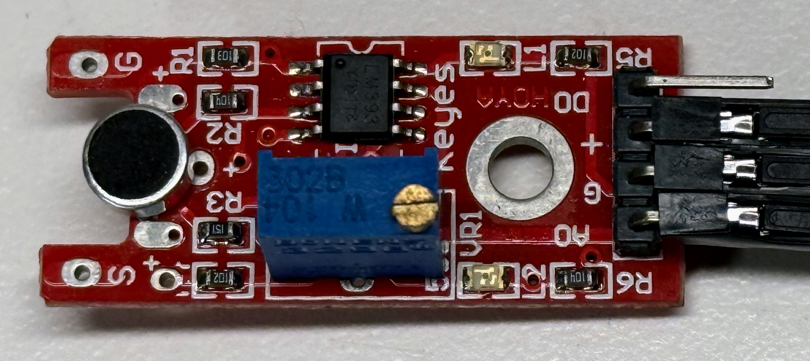

# Spectrum Analyzer Hardware

## Raspberry Pi Pico 2

The original Pico will work, however the clock is slower and it does not have built-in floating point hardware and DSP instructions to accelerate the FFT algorithms.

## Microphone

### Low Cost Sound Sensor

 

You can purchase low-cost sound sensors on eBay for about $1 each.  These devices come with an analog output that can be connected to the analog-to-digital GPIO of your Pico.  The low-cost device I used had a VERY small signal of only a few millivolts.  The ACD is looking for signals in the range of 0 to 3.3 volts. To be useful, these devices should be passed though a small amplifier to reach a voltage closer to 3 volts.

The other problem we have with these low-cost microphones is noise.  The reference voltage on the Raspberry Pi Pico has noticeable nose from the other circuits drawing power.

### INMP442

We like the [INMP442](https://dmccreary.github.io/learning-micropython/sensors/15-inmp441/) since it has an I2S interface and very low noise.

## Display

We use a 2.42" OLED display with a SSD1306 driver.

If you're prototyping on a breadboard or using standard jumper wires, stick with 4–8 MHz to ensure signal integrity and reduce data corruption.

## Breadboard

We use 1/2 size mini solderless breadboards with 400 tie-points.  This is enough to
place the Pico on the breadboard and it includes room for three mode setting buttons to change the mode of the Spectrum Analyzer.

Our [breadboard purchasing guide](https://dmccreary.github.io/learning-micropython/getting-started/02-breadboards/) can be helpful.

