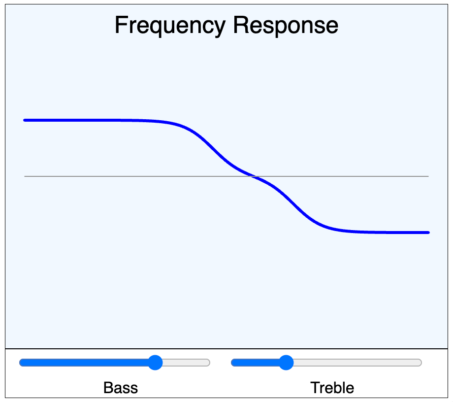

# Base and Treble Amplifier Controls

<iframe src="main.html" width="470" height="270" scrolling="no" style="overflow: hidden;"></iframe>



[Run the Base and Treble MicroSim](./base-and-treble.html){ .md-button .md-button--primary }
[Edit the Base and Treble MicroSim](https://editor.p5js.org/dmccreary/sketches/j1ND7Tl4a)

```linenums="0"
I would like to create a p5.js simulation of the frequency
response of an old classic amplifier with base and treble knobs.
Instead of knobs, use two sliders at the bottom of the canvas,
one for base and one for treble.
The sliders should start out in the middle.

Use the following p5.js template for placement of the slider controls.
```

```javascript
// region drawing parameters
// the width of the entire canvas
let canvasWidth = 400;
// The top drawing region above the interactive controls
let drawHeight = 400;
// control region height
let controlHeight = 50;
// The total hight of both the drawing region height + the control region height
let canvasHeight = 450;
// margin around the active plotting region
let margin = 25;
// larger text so students in the back of the room can read the labels
let defaultTextSize = 16;

function setup {
    const canvas = createCanvas(canvasWidth, canvasHeight);
    // canvas.parent('canvas-container');
    var mainElement = document.querySelector('main');
    canvas.parent(mainElement);
    textSize(defaultTextSize);

    // create a new slider at th bottom of the canvas
    mySlider = createSlider(0, 100, 50, 1);
    mySlider.position(sliderLeftMargin, drawHeight + 12);
    mySlider.style('width', canvasWidth -  sliderLeftMargin - 20 + 'px');
 
}

function draw() {
    // make the background drawing region a very light blue
    fill('aliceblue');
    rect(0, 0, canvasWidth, drawHeight);
    // make the background of the controls area white
    fill('white')
    rect(0, drawHeight, canvasWidth, controlHeight);

    // get the updated slider value
    val = mySlider.value();

    // put your custom code here
    

    // draw label and value
    text("MySlider: " +  val, 10, drawHeight + 25)
}
```

## Response

ChatGPT o1-preview Thought for 52 seconds

Certainly! Below is the modified p5.js code that simulates the frequency response of a classic amplifier with bass and treble controls using two sliders. The sliders start in the middle and adjust the bass and treble settings. The frequency response is plotted on the canvas, showing how the settings affect the amplifier's output.

```javascript
// region drawing parameters
// the width of the entire canvas
let canvasWidth = 400;
// The top drawing region above the interactive controls
let drawHeight = 400;
// control region height
let controlHeight = 80;
// The total height of both the drawing region height + the control region height
let canvasHeight = drawHeight + controlHeight;
// margin around the active plotting region
let margin = 25;
// larger text so students in the back of the room can read the labels
let defaultTextSize = 16;

let bassSlider, trebleSlider;

function setup() {
  const canvas = createCanvas(canvasWidth, canvasHeight);
  var mainElement = document.querySelector('main');
  canvas.parent(mainElement);
  textSize(defaultTextSize);

  // Define slider left margin
  let sliderLeftMargin = margin;

  // Create bass slider
  bassSlider = createSlider(0, 100, 50, 1);
  bassSlider.position(sliderLeftMargin, drawHeight + 12);
  bassSlider.style('width', canvasWidth - sliderLeftMargin - 20 + 'px');

  // Create treble slider
  trebleSlider = createSlider(0, 100, 50, 1);
  trebleSlider.position(sliderLeftMargin, drawHeight + 12 + 30);
  trebleSlider.style('width', canvasWidth - sliderLeftMargin - 20 + 'px');
}

function draw() {
  // Set background color
  background('white');

  // Fill the drawing region with 'aliceblue'
  fill('aliceblue');
  noStroke();
  rect(0, 0, canvasWidth, drawHeight);

  // Fill the control region with 'white'
  fill('white');
  rect(0, drawHeight, canvasWidth, controlHeight);

  // Get the updated slider values
  let bassVal = bassSlider.value();
  let trebleVal = trebleSlider.value();

  // Normalize the slider values to range -1 to 1
  let bassAmount = (bassVal - 50) / 50;
  let trebleAmount = (trebleVal - 50) / 50;

  // Define frequency range and number of points
  let numPoints = 500;
  let freqMin = 20;
  let freqMax = 20000;

  // Define EQ parameters
  let f_bass_cutoff = 500;
  let f_treble_cutoff = 2000;
  let n = 4;
  let maxGain = 12; // dB
  let gainMin = -15; // dB
  let gainMax = 15; // dB

  // Begin shape for plotting the frequency response curve
  noFill();
  stroke(0);
  beginShape();

  for (let i = 0; i < numPoints; i++) {
    let fraction = i / (numPoints - 1);
    let freq = freqMin * Math.pow(freqMax / freqMin, fraction);

    // Compute lowShelf and highShelf
    let lowShelf = 1 / (1 + Math.pow(freq / f_bass_cutoff, n));
    let highShelf = 1 / (1 + Math.pow(f_treble_cutoff / freq, n));

    // Compute gains
    let bassGain_dB = bassAmount * maxGain * lowShelf;
    let trebleGain_dB = trebleAmount * maxGain * highShelf;

    let totalGain_dB = bassGain_dB + trebleGain_dB;

    // Map frequency to x position
    let x = map(
      Math.log10(freq),
      Math.log10(freqMin),
      Math.log10(freqMax),
      margin,
      canvasWidth - margin
    );

    // Map gain to y position
    let y = map(totalGain_dB, gainMin, gainMax, drawHeight - margin, margin);

    // Plot the point
    vertex(x, y);
  }

  endShape();

  // Draw axes
  stroke(150);
  // x-axis at y = gain 0 dB
  let yZero = map(0, gainMin, gainMax, drawHeight - margin, margin);
  line(margin, yZero, canvasWidth - margin, yZero);

  // Draw labels for frequencies
  fill(0);
  textAlign(CENTER, TOP);
  text("Frequency Response", canvasWidth / 2, margin / 2);

  // Draw labels for sliders
  textAlign(LEFT, CENTER);
  fill(0);
  text("Bass", bassSlider.x + 5, bassSlider.y - 10);
  text("Treble", trebleSlider.x + 5, trebleSlider.y - 10);
}
`

```

**Explanation:**

-   **Sliders Creation:** Two sliders, `bassSlider` and `trebleSlider`, are created in the `setup()` function. They are positioned one below the other in the control area at the bottom of the canvas.

-   **Slider Values Normalization:** The values from the sliders are normalized to a range of -1 to 1 to represent the adjustment from minimum to maximum gain.

-   **Frequency Response Calculation:** The frequency response is calculated using shelving filter approximations for bass and treble adjustments. The gains are computed based on the slider positions and applied to low and high-frequency ranges.

-   **Plotting the Curve:** The frequency response curve is plotted using `beginShape()` and `vertex()`. Frequencies are mapped logarithmically to the x-axis, and gains in decibels are mapped to the y-axis.

-   **Axes and Labels:** Axes are drawn to represent 0 dB gain, and labels are added for clarity. The labels for the sliders are positioned above them.

**Note:** This code should be run in a p5.js environment. The canvas size and control regions are set according to the template provided. Adjustments can be made to the EQ parameters to simulate different amplifier characteristics.

## Refinement of Placement of Sliders

```
That was perfect. Now, please place the base slider
on the left and the treble slider on the right.
Place the labels under the sliders.

## ChatGPT Response

ChatGPT o1-preview Thought for 31 seconds

Certainly! Below is the updated p5.js code with the bass slider placed on the left and the treble slider on the right, with labels positioned under the sliders.

```javascript
// region drawing parameters
// the width of the entire canvas
let canvasWidth = 400;
// The top drawing region above the interactive controls
let drawHeight = 400;
// control region height
let controlHeight = 80;
// The total height of both the drawing region height + the control region height
let canvasHeight = drawHeight + controlHeight;
// margin around the active plotting region
let margin = 25;
// larger text so students in the back of the room can read the labels
let defaultTextSize = 16;

let bassSlider, trebleSlider;

function setup() {
  const canvas = createCanvas(canvasWidth, canvasHeight);
  var mainElement = document.querySelector('main');
  canvas.parent(mainElement);
  textSize(defaultTextSize);

  // Define slider left margin
  let sliderLeftMargin = margin;

  // Define slider width (half the canvas width minus margins)
  let sliderWidth = (canvasWidth - 3 * margin) / 2;

  // Create bass slider on the left
  bassSlider = createSlider(0, 100, 50, 1);
  bassSlider.position(sliderLeftMargin, drawHeight + 12);
  bassSlider.style('width', sliderWidth + 'px');

  // Create treble slider on the right
  trebleSlider = createSlider(0, 100, 50, 1);
  trebleSlider.position(sliderLeftMargin + sliderWidth + margin, drawHeight + 12);
  trebleSlider.style('width', sliderWidth + 'px');
}

function draw() {
  // Set background color
  background('white');

  // Fill the drawing region with 'aliceblue'
  fill('aliceblue');
  noStroke();
  rect(0, 0, canvasWidth, drawHeight);

  // Fill the control region with 'white'
  fill('white');
  rect(0, drawHeight, canvasWidth, controlHeight);

  // Get the updated slider values
  let bassVal = bassSlider.value();
  let trebleVal = trebleSlider.value();

  // Normalize the slider values to range -1 to 1
  let bassAmount = (bassVal - 50) / 50;
  let trebleAmount = (trebleVal - 50) / 50;

  // Define frequency range and number of points
  let numPoints = 500;
  let freqMin = 20;
  let freqMax = 20000;

  // Define EQ parameters
  let f_bass_cutoff = 500;
  let f_treble_cutoff = 2000;
  let n = 4;
  let maxGain = 12; // dB
  let gainMin = -15; // dB
  let gainMax = 15; // dB

  // Begin shape for plotting the frequency response curve
  noFill();
  stroke(0);
  beginShape();

  for (let i = 0; i < numPoints; i++) {
    let fraction = i / (numPoints - 1);
    let freq = freqMin * Math.pow(freqMax / freqMin, fraction);

    // Compute lowShelf and highShelf
    let lowShelf = 1 / (1 + Math.pow(freq / f_bass_cutoff, n));
    let highShelf = 1 / (1 + Math.pow(f_treble_cutoff / freq, n));

    // Compute gains
    let bassGain_dB = bassAmount * maxGain * lowShelf;
    let trebleGain_dB = trebleAmount * maxGain * highShelf;

    let totalGain_dB = bassGain_dB + trebleGain_dB;

    // Map frequency to x position
    let x = map(
      Math.log10(freq),
      Math.log10(freqMin),
      Math.log10(freqMax),
      margin,
      canvasWidth - margin
    );

    // Map gain to y position
    let y = map(totalGain_dB, gainMin, gainMax, drawHeight - margin, margin);

    // Plot the point
    vertex(x, y);
  }

  endShape();

  // Draw axes
  stroke(150);
  // x-axis at y = gain 0 dB
  let yZero = map(0, gainMin, gainMax, drawHeight - margin, margin);
  line(margin, yZero, canvasWidth - margin, yZero);

  // Draw labels
  fill(0);
  textAlign(CENTER, TOP);
  text("Frequency Response", canvasWidth / 2, margin / 2);

  // Draw labels for sliders under the sliders
  textAlign(CENTER, TOP);
  fill(0);
  text("Bass", bassSlider.x + bassSlider.width / 2, bassSlider.y + 20);
  text("Treble", trebleSlider.x + trebleSlider.width / 2, trebleSlider.y + 20);
}
```

**Explanation:**

-   **Slider Placement:** The bass slider is placed on the left side of the control area, and the treble slider is placed on the right side. Both sliders have equal widths, calculated to fit within the canvas with appropriate margins.

-   **Slider Labels:** The labels for "Bass" and "Treble" are positioned under the sliders by adjusting the `text()` function parameters in the `draw()` function.

-   **Slider Width Calculation:**

```javascript
 let sliderWidth = (canvasWidth - 3 * margin) / 2;
 ```

This calculation ensures that both sliders fit side by side within the canvas width, accounting for margins.

-   **Slider Positioning:**

-   **Bass Slider:**

```javascript
bassSlider.position(sliderLeftMargin, drawHeight + 12);
```

-   **Treble Slider:**

```javascript
 trebleSlider.position(sliderLeftMargin + sliderWidth + margin, drawHeight + 12);
```

-   **Label Positioning:** The labels are centered under each slider by using:

```javascript
textAlign(CENTER, TOP);
    text("Bass", bassSlider.x + bassSlider.width / 2, bassSlider.y + 20);
```

-   **Overall Layout:** The control area at the bottom now neatly contains both sliders side by side with labels underneath, improving the user interface and meeting your requirements.

**Note:** This code should work in a p5.js environment. Feel free to adjust the margins or slider widths if necessary to fit your specific layout preferences.